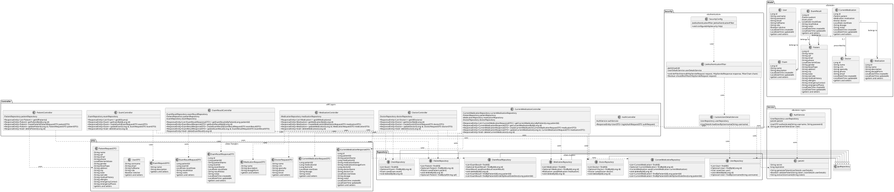
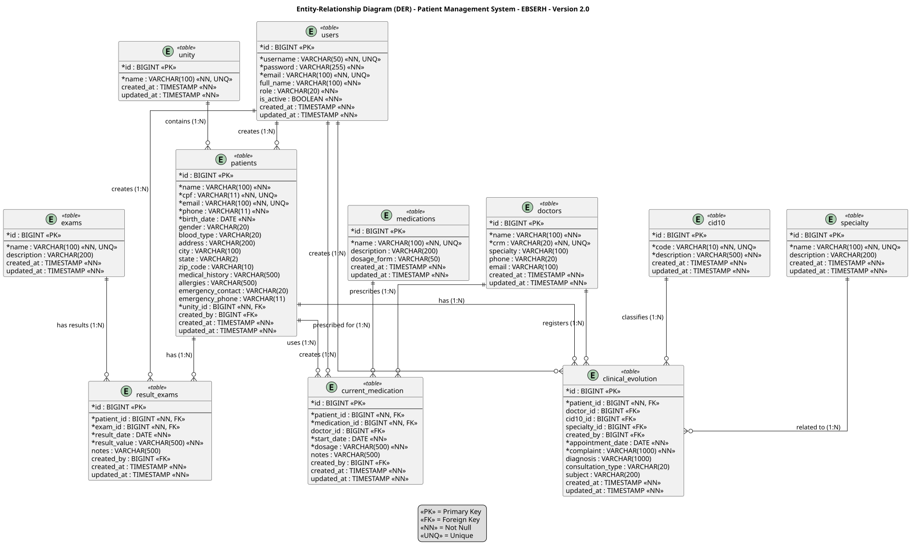

# Documentação do Sistema de Gestão de Pacientes

## Visão Geral

Este documento descreve a arquitetura do sistema de gestão de pacientes desenvolvido com Spring Boot (backend) e React (frontend).

## Tecnologias Utilizadas

### Backend
- Java 17
- Spring Boot 3.2.0
- Spring Data JPA
- Spring Security
- JWT (JJWT 0.11.5)
- H2 Database (desenvolvimento)
- PostgreSQL 15 (produção)
- Flyway (migrations)
- SpringDoc OpenAPI 2.3.0
- Maven

### Frontend
- React 19
- Vite 8.2.x
- Axios
- React Router DOM 7.18.2
- Tailwind CSS 4.3.3
- Lucide React (ícones)

## Arquitetura em Camadas

### 1. Camada de Domínio (Model)
Contém as entidades principais do sistema:

- **Patient**: Informações do paciente (nome, CPF, contato, histórico médico)
- **User**: Usuários do sistema (autenticação)
- **Exam**: Tipos de exames disponíveis
- **ExamResult**: Resultados de exames associados a pacientes
- **Medication**: Medicamentos disponíveis
- **Doctor**: Médicos responsáveis por prescrições
- **CurrentMedication**: Medicamentos em uso por pacientes

### 2. Camada de DTO (Data Transfer Objects)
Objetos para transferência de dados entre camadas:

- **PatientRequestDTO**: Criação/edição de pacientes
- **UserDTO**: Dados de usuários
- **ExamRequestDTO**: Criação/edição de exames
- **ExamResultRequestDTO**: Criação/edição de resultados
- **ExamResultResponseDTO**: Resposta de resultados (evita problemas de serialização)
- **MedicationRequestDTO**: Criação/edição de medicamentos
- **DoctorRequestDTO**: Criação/edição de médicos
- **CurrentMedicationRequestDTO**: Criação/edição de medicamentos em uso
- **CurrentMedicationResponseDTO**: Resposta de medicamentos em uso

### 3. Camada de Repositório (Data Access)
Interfaces JPA para acesso ao banco de dados:

- **PatientRepository**: Operações CRUD de pacientes
- **UserRepository**: Operações CRUD de usuários
- **ExamRepository**: Operações CRUD de exames
- **ExamResultRepository**: Operações CRUD de resultados (com filtros por paciente)
- **MedicationRepository**: Operações CRUD de medicamentos
- **DoctorRepository**: Operações CRUD de médicos
- **CurrentMedicationRepository**: Operações CRUD de medicamentos em uso (com filtros por paciente)

### 4. Camada de Controller (API Layer)
REST controllers que expõem os endpoints da API:

- **PatientController**: `/api/patients/**`
- **AuthController**: `/api/auth/**`
- **ExamController**: `/api/exams/**`
- **ExamResultController**: `/api/exam-results/**`
- **MedicationController**: `/api/medications/**`
- **DoctorController**: `/api/doctors/**`
- **CurrentMedicationController**: `/api/current-medication/**`

### 5. Camada de Serviço (Business Logic)
Lógica de negócio do sistema:

- **AuthService**: Autenticação e geração de tokens JWT
- **JwtUtil**: Utilitários para manipulação de tokens JWT

### 6. Camada de Segurança (Authentication)
Configuração de segurança e autenticação:

- **SecurityConfig**: Configuração do Spring Security
- **JwtAuthenticationFilter**: Filtro para validação de tokens JWT
- **CustomUserDetailsService**: Carregamento de detalhes do usuário

## Relacionamentos entre Entidades

### Patient
- 1:N com ExamResult (um paciente pode ter vários resultados de exames)
- 1:N com CurrentMedication (um paciente pode ter vários medicamentos em uso)

### Exam
- 1:N com ExamResult (um tipo de exame pode ter vários resultados)

### ExamResult
- N:1 com Patient (pertence a um paciente)
- N:1 com Exam (pertence a um tipo de exame)

### Medication
- 1:N com CurrentMedication (um medicamento pode estar em uso por vários pacientes)

### Doctor
- 1:N com CurrentMedication (um médico pode prescrever vários medicamentos)

### CurrentMedication
- N:1 com Patient (pertence a um paciente)
- N:1 com Medication (é um tipo de medicamento)
- N:1 com Doctor (opcional - prescrito por um médico)

### Relacionamentos entre Entidades (DER)

#### Tabela Principal: patients
- **1:N** com result_exams (um paciente pode ter vários resultados de exames)
- **1:N** com current_medication (um paciente pode ter vários medicamentos em uso)

#### Tabela Principal: exams
- **1:N** com result_exams (um tipo de exame pode ter vários resultados)

#### Tabela Principal: medications
- **1:N** com current_medication (um medicamento pode estar em uso por vários pacientes)

#### Tabela Principal: doctors
- **1:N** com current_medication (um médico pode prescrever vários medicamentos)

#### Tabela Principal: users
- **1:N** com patients (relação conceitual de gerenciamento)

#### Tabelas Relacionais:
- **result_exams**: Tabela que conecta patients com exams (relacionamento N:1 patients, N:1 exams)
- **current_medication**: Tabela que conecta patients com medications e doctors (relacionamento N:1 patients, N:1 medications, N:1 doctors opcional)

#### Regras de Integridade:
- **ON DELETE CASCADE**: Se um paciente for excluído, seus resultados de exames e medicamentos em uso são excluídos automaticamente
- **ON DELETE CASCADE**: Se um exame for excluído, seus resultados são excluídos automaticamente
- **ON DELETE CASCADE**: Se um medicamento for excluído, os registros de medicamentos em uso são excluídos automaticamente
- **ON DELETE SET NULL**: Se um médico for excluído, os registros de medicamentos em uso têm o campo doctor_id definido como NULL

## Database Migrations

O sistema usa Flyway para versionamento do banco de dados:

- **V1**: Create Patients Table
- **V2**: Insert Sample Data (pacientes)
- **V3**: Create Users Table
- **V4**: Insert Admin User
- **V5**: Create Exams Table
- **V6**: Create Result Exams Table
- **V7**: Insert Sample Exams (10 exames)
- **V8**: Create Medications Table
- **V9**: Create Doctors Table
- **V10**: Create Current Medication Table
- **V11**: Insert Sample Medications (10 medicamentos)
- **V12**: Insert Sample Doctors (5 médicos)

## API Endpoints

### Autenticação
- `POST /api/auth/login` - Login e geração de token JWT

### Pacientes
- `GET /api/patients` - Listar todos os pacientes
- `GET /api/patients/{id}` - Buscar paciente por ID
- `POST /api/patients` - Criar novo paciente
- `PUT /api/patients/{id}` - Atualizar paciente
- `DELETE /api/patients/{id}` - Excluir paciente

### Exames
- `GET /api/exams` - Listar todos os tipos de exames
- `GET /api/exams/{id}` - Buscar exame por ID
- `POST /api/exams` - Criar novo tipo de exame
- `PUT /api/exams/{id}` - Atualizar exame
- `DELETE /api/exams/{id}` - Excluir exame

### Resultados de Exames
- `GET /api/exam-results/patient/{patientId}` - Listar resultados por paciente
- `GET /api/exam-results/{id}` - Buscar resultado por ID
- `POST /api/exam-results` - Criar novo resultado
- `PUT /api/exam-results/{id}` - Atualizar resultado
- `DELETE /api/exam-results/{id}` - Excluir resultado

### Medicamentos
- `GET /api/medications` - Listar todos os medicamentos
- `GET /api/medications/{id}` - Buscar medicamento por ID
- `POST /api/medications` - Criar novo medicamento
- `PUT /api/medications/{id}` - Atualizar medicamento
- `DELETE /api/medications/{id}` - Excluir medicamento

### Médicos
- `GET /api/doctors` - Listar todos os médicos
- `GET /api/doctors/{id}` - Buscar médico por ID
- `POST /api/doctors` - Criar novo médico
- `PUT /api/doctors/{id}` - Atualizar médico
- `DELETE /api/doctors/{id}` - Excluir médico

### Medicamentos em Uso
- `GET /api/current-medication/patient/{patientId}` - Listar medicamentos por paciente
- `GET /api/current-medication/{id}` - Buscar medicamento em uso por ID
- `POST /api/current-medication` - Criar novo medicamento em uso
- `PUT /api/current-medication/{id}` - Atualizar medicamento em uso
- `DELETE /api/current-medication/{id}` - Excluir medicamento em uso

## Frontend Components

### Componentes UI Reutilizáveis
- **Button**: Botões com diferentes variantes
- **Card**: Cards com header, content e footer
- **Input**: Inputs com validação
- **Label**: Labels para formulários
- **Table**: Tabelas com header e body
- **Badge**: Badges com diferentes variantes
- **Box**: Container flexível

### Componentes de Navegação
- **Layout**: Layout principal com sidebar
- **Login**: Tela de login
- **PatientList**: Lista de pacientes com ações

### Componentes de Funcionalidades
- **Exams**: Gestão de exames por paciente
- **Medications**: Gestão de medicamentos por paciente
- **Tests**: Tela de testes

## Diagramas

### Diagrama de Classes
Mostra a estrutura das classes Java, pacotes e relacionamentos entre componentes do sistema, incluindo:
- Camadas de arquitetura (Model, DTO, Repository, Controller, Service, Security)
- Relacionamentos entre classes
- Herança e composição
- Métodos e atributos principais

### Diagrama de Entidade e Relacionamento (DER)
Mostra a estrutura do banco de dados e relacionamentos entre tabelas, incluindo:
- Tabelas principais (patients, users, exams, result_exams, medications, doctors, current_medication)
- Chaves primárias (PK) e estrangeiras (FK)
- Relacionamentos 1:N e N:1
- Restrições de NOT NULL e UNIQUE
- Campos e tipos de dados

## Como Visualizar os Diagramas

### Diagrama de Classes



### Diagrama de Entidade e Relacionamento (DER)



### Opção 1: Online (PlantUML)
1. Acesse https://plantuml.com/online
2. Cole o conteúdo do arquivo `diagrama-classes.puml` ou `diagrama-entidade-relacionamento.puml`
3. Clique em "Generate"

### Opção 2: Visual Studio Code
1. Instale a extensão "PlantUML"
2. Abra o arquivo `diagrama-classes.puml` ou `diagrama-entidade-relacionamento.puml`
3. Pressione `Alt+D` para gerar o diagrama

### Opção 3: IntelliJ IDEA
1. Instale o plugin "PlantUML integration"
2. Abra o arquivo `diagrama-classes.puml` ou `diagrama-entidade-relacionamento.puml`
3. Clique com botão direito e selecione "Show Diagram"

## Estrutura de Diretórios

```
ebserh/
├── backend/
│   ├── src/main/java/com/ebserh/patientapi/
│   │   ├── config/          # Configurações
│   │   ├── controller/      # REST Controllers
│   │   ├── model/          # Entidades e DTOs
│   │   ├── repository/     # JPA Repositories
│   │   ├── security/       # Configuração de segurança
│   │   ├── service/        # Serviços de negócio
│   │   └── exception/      # Tratamento de exceções
│   └── src/main/resources/
│       ├── db/migration/   # Migrations Flyway
│       └── application.properties
├── frontend/
│   ├── src/
│   │   ├── api/           # Integração com API
│   │   ├── components/    # Componentes React
│   │   ├── context/       # Contextos (Auth)
│   │   └── lib/           # Utilitários
│   └── public/
├── docs/                  # Documentação
├── k8s/                   # Manifests Kubernetes
└── docker-compose.yml     # Docker Compose
```

## Próximos Passos

1. Adicionar testes unitários para controllers
2. Implementar validações mais robustas
3. Adicionar tratamento de exceções específico
4. Implementar caching para consultas frequentes
5. Adicionar auditoria de operações
6. Implementar backup e restore do banco de dados